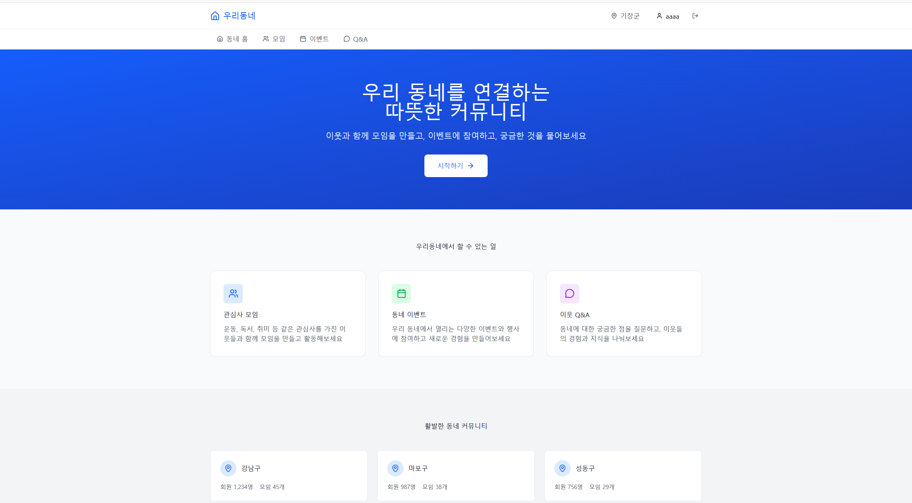
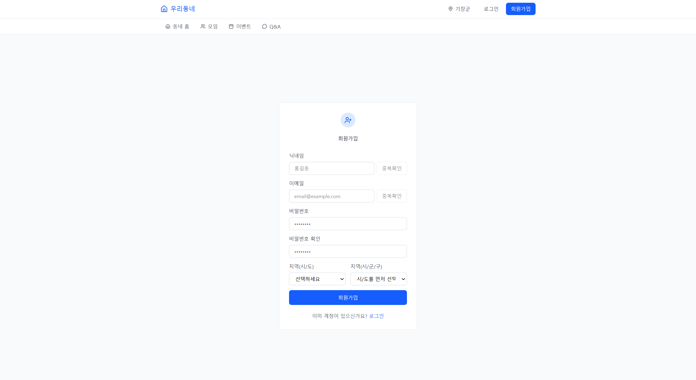
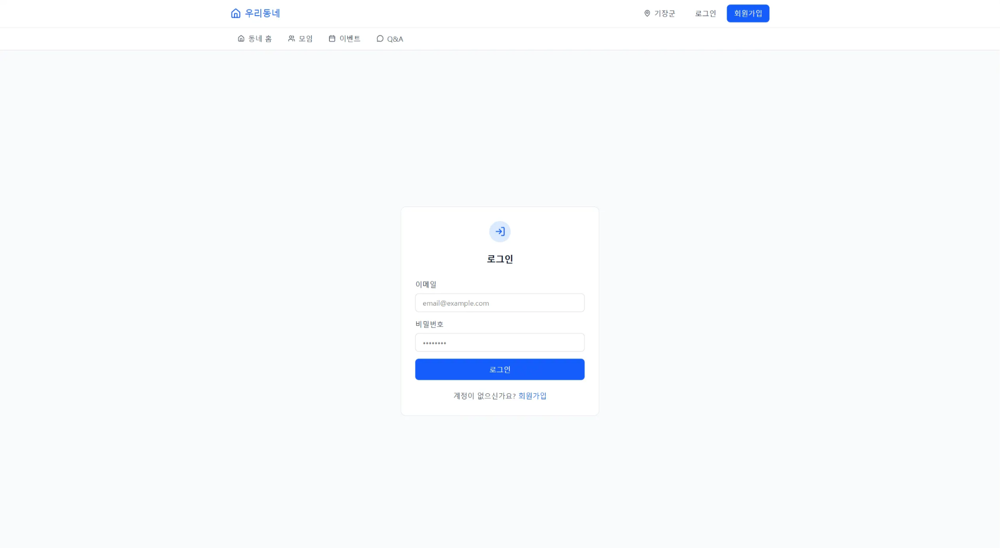

<div align="center">
  <h1>TownHub</h1>
  <p>지역 기반 커뮤니티 플랫폼</p>
</div>

<br/>

<div align="center">
  
</div>

<br/>

<div align="center">
  <!-- 배포 완료 후 링크 수정 -->
<div align="center">
  <a href="#">배포 주소 (준비 중)</a>
  &nbsp; | &nbsp;
  <a href="https://www.notion.so/2d2ae60c3e9881d1a3a9c4fe49a35b66">Notion</a>

</div>

</div>
<br/>


## 프로젝트 개요

- **프로젝트명:** TownHub
- **프로젝트 기간:** 2025.12 ~ 2026.01 (1차 구현 완료)
- **프로젝트 형태:** 부트캠프 팀 프로젝트
- **개발 방식:** Frontend / Backend 분리 개발
- **목표:**  
  지역(Location)을 기준으로 질문, 모임, 이벤트 기능을 제공하는 커뮤니티 서비스 구현
- **대상 사용자:** 지역 기반 커뮤니티 사용자


## 프로젝트 소개

### 프로젝트 배경

기존 지역 커뮤니티 서비스에서는 다음과 같은 한계가 있었습니다.

1. **지역 기준 정보 분리의 부족**
   - 지역과 무관한 게시글이 혼재되어 정보 탐색 효율이 낮음
2. **기능별 서비스 분산**
   - 질문, 모임, 이벤트 기능이 각각 다른 플랫폼에서 운영됨
3. **권한 및 참여 관리의 복잡성**
   - 모임 및 이벤트 참여 승인, 멤버 관리 기능이 체계적으로 제공되지 않음

TownHub는 이러한 문제를 해결하기 위해  
**지역 기반 데이터 구조와 역할(Role) 기반 권한 제어**를 중심으로 설계되었습니다.

---

### 문제 해결 방식

- **Location 기반 데이터 설계**
  - 모든 질문, 모임, 이벤트는 사용자 지역을 기준으로 조회
- **역할 기반 권한 제어**
  - 작성자 / 호스트 권한 분리
- **서비스 흐름 반영**
  - 참여 신청 → 승인 구조
  - 멤버 관리 및 강퇴 기능 제공


## 프로젝트 목표

1. 지역 기반 커뮤니티 기능 구현
2. RESTful API 설계 및 인증/인가 구조 구현
3. 프론트엔드–백엔드 분리 구조 경험
4. 실제 서비스 수준의 기능 완성도 확보


## 주요 기능

### 0. 회원가입 | 로그인

#### 회원가입

<div align="center">
  
</div>

- 이메일
- 닉네임
- 비밀번호
- 지역 정보(Location)

---

#### 로그인

<div align="center">
  
</div>

- JWT 기반 인증
- Access Token / Refresh Token 사용
- Refresh Token은 HttpOnly Cookie로 관리

---

### 1. 질문 / 답변 (Q&A)

- 질문 생성 / 수정 / 삭제
- 질문 목록 조회
  - 페이지네이션
  - 검색
  - 카테고리 필터
- 질문 상세 조회
- 조회수 증가
- 답변 생성 / 수정 / 삭제
- 답변 목록 조회
- 답변 채택 / 채택 취소
  - 질문 작성자만 가능

---

### 2. 모임 (Meeting)

- 모임 생성 / 수정
- 모임 목록 조회
  - 페이지네이션
  - 검색
  - 카테고리 / 상태 필터
- 모임 상세 조회
- 모임 가입 신청
- 가입 신청 승인 / 거절 (호스트 전용)
- 모임 멤버 목록 조회 (호스트 전용)
- 모임 멤버 강퇴 (호스트 전용)

---

### 3. 이벤트 (Event)

- 일반 이벤트 목록 조회
- 번개 이벤트(FLASH) 조회
- 이벤트 캘린더 조회 (날짜 범위)
- 이벤트 생성 / 수정 / 삭제
- 이벤트 상세 조회

---

### 4. 이벤트 참여 관리

- 이벤트 참여 신청 / 취소
- 참여 신청 목록 조회 (주최자 전용)
- 참여 승인 / 거절 (주최자 전용)
- 이벤트 멤버 목록 조회 (주최자 전용)
- 이벤트 멤버 삭제 (주최자 전용)

---

## 인증 / 권한 구조

- 인증 방식: JWT
- Access Token
  - Authorization Header 사용
- Refresh Token

  - HttpOnly Cookie로 관리

- 로그인 시 Access Token 발급
- Access Token 만료 시 Refresh Token 기반 재발급
- 모든 API는 공통 응답 포맷(`ApiResponse<T>`)을 사용

### 권한 예시

- 질문 채택: 질문 작성자
- 모임 관리: 모임 호스트
- 이벤트 관리: 이벤트 주최자
- 수정 / 삭제: 작성자만 가능


## 팀원 소개

| 이름                                          | 역할 |
| --------------------------------------------- | ---- |
| [성시영](https://github.com/성시영_GITHUB_ID) | 팀장 |
| [박나현](https://github.com/박나현_GITHUB_ID) |      |
| [전주현](https://github.com/전주현_GITHUB_ID) |      |
| [강우연](https://github.com/강우연_GITHUB_ID) |      |
| [천성주](https://github.com/천성주_GITHUB_ID) |      |


## 기술 스택

### Frontend


### Backend


### Database


<br/>


## 프로젝트 구조

```
Townhub/
├── backend/                    # Spring Boot 백엔드
│   ├── src/main/java/com/example/backend/
│   │   ├── controller/         # REST API 컨트롤러
│   │   ├── service/            # 비즈니스 로직
│   │   ├── repository/         # 데이터 접근 계층
│   │   ├── domain/             # 엔티티
│   │   ├── dto/                # 데이터 전송 객체
│   │   ├── security/            # 인증/인가 설정
│   │   └── global/             # 전역 예외 처리, 응답 형식
│   └── build.gradle
│
└── frontend/                   # Next.js 프론트엔드
    ├── src/app/
    │   ├── api/                # API 호출 함수
    │   ├── components/         # 재사용 컴포넌트
    │   ├── contexts/           # React Context (Auth, Town)
    │   └── town/               # 페이지 컴포넌트
    └── package.json
```


# Docs

- [개발 컨벤션](./docs/convention.md)
- [API 명세서](https://spark-twist-801.notion.site/Api-2d5ae60c3e9880f08af9fa6c45351aa7?source=copy_link)
